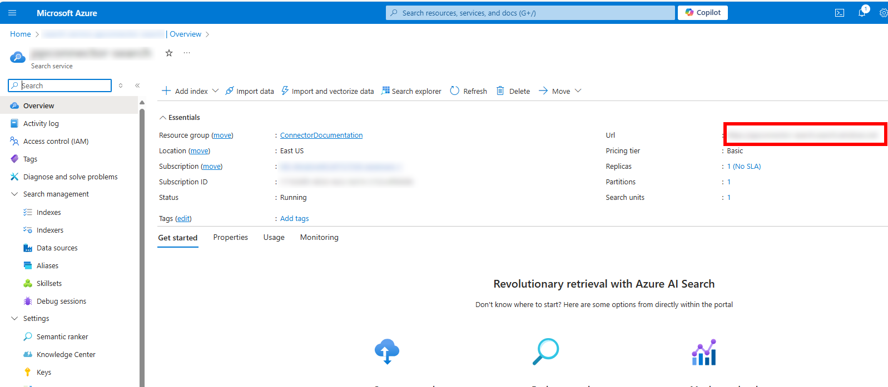

# Using Azure AI Search as a Copilot Studio Generative Answers Knowledge Source

Azure AI Search is a powerful search engine that can be used to search for information in a large collection of documents. It can use any of the Azure OpenAI Models and can be used to search for information in a wide range of domains. In this article, we will show you how to use Azure AI Search as a Copilot Studio Knowledge Source for Generative Answers.

More information about this topic is found in the [Copilot Studio Documentation](https://learn.microsoft.com/en-us/microsoft-copilot-studio/nlu-generative-answers-azure-openai)

## Table of Contents

- [Using Azure AI Search as a Copilot Studio Generative Answers Knowledge Source](#using-azure-ai-search-as-a-copilot-studio-generative-answers-knowledge-source)
  - [Table of Contents](#table-of-contents)
  - [Pre-requisites](#pre-requisites)
  - [Create an Azure Open AI Service](#create-an-azure-open-ai-service)
  - [Create an Azure Open AI Deployment](#create-an-azure-open-ai-deployment)
  - [Create an Azure AI Search Service](#create-an-azure-ai-search-service)
  - [Create an Index in Azure AI Search](#create-an-index-in-azure-ai-search)
  - [Connect Copilot Studio Generative Answers to Azure AI Search](#connect-copilot-studio-generative-answers-to-azure-ai-search)
    - [Step 1: Create a connection to Azure AI Search](#step-1-create-a-connection-to-azure-ai-search)
    - [Step 2: Connect a Generative Answers Knowledge Source](#step-2-connect-a-generative-answers-knowledge-source)
      - [Finding the Connection Parameters](#finding-the-connection-parameters)
    - [Step 3: Test the Connection](#step-3-test-the-connection)

## Pre-requisites

To use Azure AI Search as a Copilot Studio Generative Answers Knowledge Source, you will need to have an Azure account. If you don't have an Azure account, you can create one for free at [https://azure.microsoft.com/](https://azure.microsoft.com/).

## Create an Azure Open AI Service

Detailed instructions are [here](./create-azure-openai-service.md)

> **NOTE** You will need the Azure OpenAI Resource name and API key to connect Copilot Studio to Azure Open AI. You can find this information in the Azure portal under your Azure Open AI service.

  
*Azure Open AI Resource Name*

  
*Azure Open AI API Manage Keys*

  
*Azure Open AI API Key*

## Create an Azure Open AI Deployment

Detailed instructions are [here](./create-azure-openai-deployments.md)

Deploy both a completion model (for example, `gpt-35-turbo-16k`) and an embedding model (for example, `text-embedding-ada-002`).

> **NOTE** You will need the deployment names to connect Copilot Studio to Azure Open AI. You can find this information in the Azure OpenAI Studio portal or the Azure AI Studio portal portal under Deployments.

## Create an Azure AI Search Service

Detailed instructions are [here](./create-azure-ai-search-service.md)

> **NOTE** You will need the endpoint URL and API key to connect Copilot Studio to Azure Open AI Search. You can find this information in the Azure portal under your Azure Open AI Search service.

  
*Azure AI Search Endpoint URL*

  
*Azure AI Search API Key*

> **NOTE** The API Key must be one of the two main keys. A Query key will not work.

## Create an Index in Azure AI Search

Detailed instructions are [here](./create-azure-ai-search-index.md)

Once the index is created, you will see it listed in the Azure AI Search service indexes.

## Connect Copilot Studio Generative Answers to Azure AI Search

To connect Copilot Studio Generative Answers to Azure Open AI Search, follow these steps:

### Step 1: Create a connection to Azure AI Search

To connect Copilot Studio Generative Answers to Azure AI Search, you will need to create a connection in the Power Apps Portal. To do this, follow these steps:

1. Go to the Power Apps Portal at [https://make.powerapps.com/](https://make.powerapps.com/).
1. Click on the "Connections" tab in the left-hand navigation pane.  
**NOTE** If you don't see the "Connections" tab, click on the "More" tab and then click on the "Connections" tab.
1. Click on the "New connection" button.
1. Search for "Azure OpenAI" in the search bar.
1. Click on the "Azure OpenAI" connection.
1. Click on the "Create" button.
1. Enter your Azure OpenAI resource name and API key.  
**NOTE:** You can find your Azure OpenAI resource name and API key in the Azure portal under your Azure OpenAI Search service. See [here](#create-an-azure-open-ai-service).
1. Enter your Azure Cognitive Search endpoint URL and API key.  
**NOTE:** This is the whole URL - You can find your Azure Cognitive Search endpoint URL and API key in the Azure portal 1nder your Azure Open AI Search service. See [here](#create-an-azure-ai-search-service).  
**NOTE** The API Key must be one of the two main keys. A Query key will not work.
1. Click on the "Create" button.
1. Once the connection is created, you will see it listed in the "Connections" tab.  
**NOTE** It's always a good idea to rename the connection to something more meaningful and descriptive to make it easier to find later in Copilot Studio.

### Step 2: Connect a Generative Answers Knowledge Source

To connect a Generative Answers Knowledge Source to Azure AI Search, follow these steps:

1. Go to the Copilot Studio portal at [https://copilotstudio.microsoft.com/](https://copilotstudio.microsoft.com/).
1. Choose the appropriate environment from the drop-down list in the top right corner.
1. Create a new copilot or open an existing one.
1. Navigate to the "Conversation Boosting" topic.
1. In the "Create generative answers" node, choose the ellipses in the top-right corner and select "Properties".
1. In the "Properties" pane, expand the "Classic data" section.
1. Navigate to the "Azure OpenAI Services on your data" section.
1. Click on the "Add connection" button.
1. Select the connection you created in [Step 1](#step-1-create-a-connection-to-azure-ai-search).
1. Click on the "Connection properties" button.
1. Under the "General" tab, enter the following information:
    - **Deployment**: Enter the name of the completions [deployment you created in Azure OpenAI](#create-an-azure-open-ai-deployment) (e.g. `gpt-35-turbo-16k`).
    - **Api version**: 2024-02-15-preview (confirm this is correct - see [below](#finding-the-connection-parameters)).
    - **Maximum tokens in response**: 800 (optional).
    - **Temperature**: 0.7 (optional).
    - **Top P**: 0.95 (optional).
    - **Stop sequence**: (not required).
1. Under the "Model data" tab, click the "Add button" to add a data source and enter the following information (for an easy way to find these values, see [below](#finding-the-connection-parameters)):
    - **Index name**: Enter the name of the index you created in Azure OpenAI Search.
    - **Title**: Enter the name of the title field in the index. (default `title`)
    - **URL**: Enter the name of the field containing the URL for the retrieved content. (default `metadata_storage_path`)
    - **File name**: Enter the name of the field containing the file name for the retrieved content. (default blank)
    - **Content data**: enter the name(s) of the field(s) that contain the content retrieved. Press enter or the `+` button after each field name. (default is `chunk`)
    - **Vector data**: enter the name(s) of the field(s) that contain the vector data for this chunk. Press enter or the `+` button after each field name. (default is `text_vector`)
    - **Embedding deployment name**: Enter the name of the embedding deployment you created [above](#create-an-azure-open-ai-deployment).
    - **Semantic search configuration**: Enter the name of the semantic search configuration associated with the index you created [above](#create-an-index-in-azure-ai-search).
    - **Query type**: Enter the type of query to be used for the search. (default `semantic`)
    - **System message**: Enter the prompt to be passed to the Azure Open AI Service. (default `You are an AI assistant that helps people find information.`)
    **Limit responses to your data content**: Should the model limit its responses to only the content retrieved (default blank)
    **Strictness**: The strictness of the search relevance filtering (range: 1 to 5). Higher strictness results in higher precision but lower recall of the answer. (default blank)
    **Top N documents**: The number of top documents to feature for a query. (default blank)
1. Click on the "Save" button.

#### Finding the Connection Parameters

To easily find the raining connection parameters, follow these steps:

1. Go to the Azure OpenAI Studio portal at [https://oai.azure.com/](https://oai.azure.com/).
1. Click on the "Chat" button in the left hand navigation pane.
1. Choose the completions deployment you created [above](#create-an-azure-open-ai-deployment).
1. Click on the "Add your data" button and click the "Add a data source" button.
1. Select "Azure Ai Search" as the data source and choose the [Search service](#create-an-azure-ai-search-service) and [Search index](#create-an-index-in-azure-ai-search).
1. Click the "Next" button.
1. Leave the Search type as "Semantic" and select the semantic configuration from the dropdown.
1. Click the "Next" button.
1. Change the Authentication type to "API key"
1. Click the "Next" button.
1. Click the "Save and close" button.
1. Click the "View code" button
1. Choose a language from the dropdown and examine the code generated. All of the connection parameters are in the code. If you cannot quickly find one of the parameters, one of the other languages may make it more obvious.

### Step 3: Test the Connection

To test the connection, follow these steps:

1. In the "Copilot Studio UI" node, click on the "Test" button if the test pane is not visible"
1. Ask a question that can be answered by your Azure AI Search data source.
